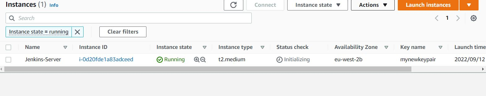
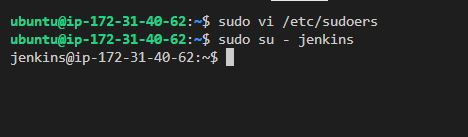

### Setting up a Kubernetes and Jenkins pipeline in AWS
### We shall first set up the Jenkins server on a virtual machine (EC2)
SPIN EC2 INSTANCE FOR OUR JENKINS SERVER

- Launch EC2 Ubuntu T2 Medium
- Save pem key for SSH Tasks
- Open port 8080 for jenkins in security group and 22 if not already open
- CHMOD the pem key to 660
```
chmod +660 mynewkeypair.pem
```



### I WILL NOW CONNECT TO MY EC2 INSTANCE VIA SSH
- Go to my instance > SSH client and copy connection string

```
ssh -i "mynewkeypair.pem" ubuntu@ec2-3-8-206-166.eu-west-2.compute.amazonaws.com
```

### UPDATE, install JDK, THEN JENKINS

```
sudo apt-get update
```
### Check if Java installed

```
java -version
```
### Not installed so I will install java
```
sudo apt install openjdk-11-jre-headless
```

1. Add Jenkins repository to package managaer
```
wget -q -O - https://pkg.jenkins.io/debian-stable/jenkins.io.key | sudo apt-key add -

sudo sh -c 'echo deb https://pkg.jenkins.io/debian-stable binary/ > /etc/apt/sources.list.d/jenkins.list' 
```
### Update the package manager
```
sudo apt-get update
```
### Install Jenkins
```
sudo apt install jenkins
```
### Check that |jenkins is installed and running 
```
sudo systemctl status jenkins
```
## I WILL NOW LOG INTO JENKINS VIA BROWSER USING THE ec2 instances public IP address on port 8080
```
http://35.178.44.25:8080/
```
### got to /var/lib/jenkins/secrets/initialAdminPassword for Password

```
sudo cat /var/lib/jenkins/secrets/initialAdminPassword
```
### copy and enter password on http://35.178.44.25:8080/

- select Install suggested plugins option

### WE NEED TO GIVE ADMIN PRIVILEGES TO JENKINS TO BE ABLE TO RUN OUR PIPELINE (DOCKER,GRADLE, KUBERNETES )
To interact with the Kubernetes cluster, Jenkins will be executing the shell script with the Jenkins user, so the Jenkins user should have thenecessary privileges.

I will add Jenkins as an administrator and assign NOPASSWD so that the root password wouldn't be requested when the pipeline is running.

Open the file /etc/sudoers

```
sudo vi /etc/sudoers
```
Assign admin priviledge and no password required
```
jenkins ALL=(ALL) NOPASSWD: ALL
```
### and then :wq! to save and quit vi
### Now i have given jenkins the privileges it needs
```
sudo su - jenkins
```


Now we need to install docker using the Jenkins user as it has root user privileges.

```
sudo apt install docker.io
```
Verify the installation

``` 
docker --version 
```
### As Jenkins will be accessing docker to build images , we need to add it to the docker grouo as it will be running some docker commands
```
jenkins@ip-172-31-10-104:~$ docker --version
Docker version 20.10.12, build 20.10.12-0ubuntu4
jenkins@ip-172-31-10-104:~$ sudo usermod -aG docker jenkins
jenkins@ip-172-31-10-104:~$ aws --version
aws-cli/1.22.34 Python/3.10.4 Linux/5.15.0-1011-aws botocore/1.23.34
```
### I ran docker image ls to see list of docker images
```
jenkins@ip-172-31-40-62:~$ docker image ls
Got permission denied while trying to connect to the Docker daemon socket at unix:///var/run/docker.sock: Get "http://%2Fvar%2Frun%2Fdocker.sock/v1.24/images/json": dial unix 
/var/run/docker.sock: connect: permission denied
jenkins@ip-172-31-40-62:~$ 
```
### I need to restart the instance for tit to be updated with the new configuration

### From the AWS console, select the reboot instance action.

### log back into the instance
### log in as the jenkins user
```
sudo su - jenkins
```
### Check docker command again by running docker image ls
```
jenkins@ip-172-31-40-62:~$ docker image ls
REPOSITORY   TAG       IMAGE ID   CREATED   SIZE
jenkins@ip-172-31-40-62:~$
```

### I will now install AWS CLI on the jenkins server
```
sudo apt install awscli
```
### Verify installation
```
jenkins@ip-172-31-40-62:~$ aws --version
aws-cli/1.22.34 Python/3.10.4 Linux/5.15.0-1011-aws botocore/1.23.34
jenkins@ip-172-31-40-62:~$ 
```

### NEXT, I WILL INSTALL KUBECTL - kubectl, allows you to run commands against Kubernetes clusters using the kubernetes API. 

```
curl -LO "https://storage.googleapis.com/kubernetes-release/release/$(curl -s https://storage.googleapis.com/kubernetes-release/release/stable.txt)/bin/linux/amd64/kubectl"

chmod +x ./kubectl 
sudo mv ./kubectl /usr/local/bin
```
### Next I will install eksctl - for creating and managing clusters on EKS - Amazon's managed Kubernetes service for EC2
```
curl --silent --location "https://github.com/weaveworks/eksctl/releases/latest/download/eksctl_$(uname -s)_amd64.tar.gz" | tar xz -C /tmp
```
### Move
```
sudo mv /tmp/eksctl /usr/local/bin
```
### Verify installation
```
eksctl version
```
```
jenkins@ip-172-31-10-104:~$ kubectl version
WARNING: This version information is deprecated and will be replaced with the output from kubectl version --short.  Use --output=yaml|json to get the full version.
Client Version: version.Info{Major:"1", Minor:"25", GitVersion:"v1.25.0", GitCommit:"a866cbe2e5bbaa01cfd5e969aa3e033f3282a8a2", GitTreeState:"clean", BuildDate:"2022-08-23T17:44:59Z", GoVersion:"go1.19", Compiler:"gc", Platform:"linux/amd64"}
Kustomize Version: v4.5.7
Error from server (Forbidden): <html><head><meta http-equiv='refresh' content='1;url=/login?from=%2Fversion%3Ftimeout%3D32s'/><script>window.location.replace('/login?from=%2Fversion%3Ftimeout%3D32s');</script></head><body style='background-color:white; color:white;'>

```


### I will now create the kubernetes clusters as follows
- Name of the cluster : --name dele-test-cluster
- Version of Kubernetes : --version 1.23
- Region : --name eu-west-2
- Nodegroup name/worker nodes : worker-nodes
- Node Type : t2.micro
- Number of nodes: -nodes 2

### The command is
```
eksctl create cluster --name dele-test-cluster --version 1.23 --region eu-west-2 --nodegroup-name worker-nodes --node-type t2.micro --nodes 2
```

## KUBECTL VERSION IS v1.25.0